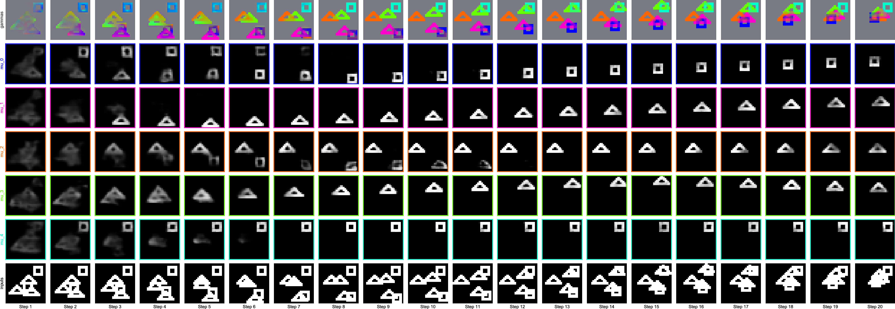

# Neural Expectation-Maximization



This is the code repository complementing the paper ["Neural Expectation Maximization"](https://arxiv.org/abs/1708.03498). All experiments from the paper
can be reproduced from this repository. The datasets can be found [here](https://www.dropbox.com/sh/1ue3lrfvbhhkt6s/AAB6WiZzH_mAtCjW6b9okMGea?dl=0).

## Dependencies and Setup

- tensorflow==1.2.1
- numpy >= 1.13.1
- sacred == 0.7.0
- pymongo == 3.4.0
- Pillow == 4.2.1
- scipy >= 0.19.1
- scikit-learn >= 0.18.2
- scikit-image >= 0.13.0
- matplotlib >= 2.0.2
- h5py >= 2.7.0

## Experiments 

Use the following calls to recreate the experiments

### Static Shapes

RNN-EM

```bash
python nem.py with dataset.shapes network.shapes nem.k=4 nem.nr_steps=15 noise.prob=0.1
```

N-EM 

```bash
python nem.py with dataset.shapes network.NEM nem.k=4 nem.nr_steps=15 noise.prob=0.1
```

### Flying Shapes

```bash
python nem.py with nem.sequential dataset.flying_shapes network.flying_shapes nem.k=3 nem.nr_steps=20
```

By varying K and the number of objects in the dataset (by using `dataset.flying_shapes_4`
, or `dataset.flying_shapes_5`)
all results in Table 1 can be computed.

### Flying MNIST

Training directly 

```bash 
python nem.py with nem.sequential dataset.flying_mnist_hard_2 network.flying_mnist nem.k=2 nem.nr_steps=20 nem.loss_inter_weight=0.2 training.params.learning_rate=0.0005
```

Training in stages:

20 variations:

```bash 
python nem.py with nem.sequential dataset.flying_mnist_medium_20_2 network.flying_mnist nem.k=2 nem.nr_steps=20 nem.loss_inter_weight=0.2
```

500 variations:

```bash 
python nem.py with nem.sequential dataset.flying_mnist_medium_500_2 network.flying_mnist nem.k=2 nem.nr_steps=20 nem.loss_inter_weight=0.2 training.params.learning_rate=0.0005 net_path=debug_out/best
```

full dataset:

```bash 
python nem.py with nem.sequential dataset.flying_mnist_hard_2 network.flying_mnist nem.k=2 nem.nr_steps=20 nem.loss_inter_weight=0.2 training.params.learning_rate=0.0005 net_path=debug_out/best
```

## Evaluation 

During training an overview of the losses as well as ARI scores on the train and validation set 
(by default only on the first 1000 samples) are computed. At test-time one can compute the AMI scores 
(which are much more expensive to compute), or next-step prediction loss by using the `run_from_file` command. 
 
For example when training RNN-EM on flying shapes using the following config: 
 
```bash 
python nem.py with nem.sequential dataset.flying_shapes network.flying_shapes nem.k=3 nem.nr_steps=20
```

one could evaluate it on the test set and compute the AMI scores by calling:

```bash 
python nem.py run_from_file with <config, see above> run_config.AMI=True
```

or similarly obtain the BCE next-step prediction loss by calling: 

```bash 
python nem.py run_from_file with <config, see above> run_config.AMI=False
```
